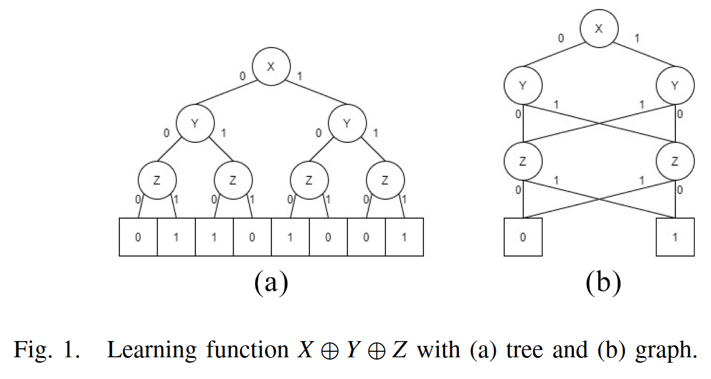

# Criterios de escogencia

## Viabilidad

- No se cuentan con computadores de alto rendimiento para llevar a cabo
entrenamientos extensivos.
- AxLS en sí no tiene alguna restricción para no implementar métodos que
requieran mucho tiempo y procesamiento, pero al ser open source podría
tener una amplia variedad de usuarios, por lo que sería favorable que
cualquier usuario pueda ejecutarla a completitud. Al menos, que cualquier
usuario pueda probar la mayor variedad de métodos posibles sería favorable
para que la herramienta obtenga mayor adopción y posiblemente utilidad.
- Si es posible ejecutar las pruebas rápidamente, eso es altamente preferible
para que sea fácil verificar el funcionamiento del método y que cualquier
usuario lo ejecute con mayor facilidad.
Arbitrariamente podríamos decir que es favorable durar menos de 5mins en
ejecutar todas las pruebas, pero en este momento no sé si eso es realista.
- También se tomará en cuenta la viabilidad de la implementación, ya que este
proyecto cuenta con poco tiempo para la ipmlementación, alrededor de 3 semanas.

## Estado del arte

- Es preferible implementar un método lo más moderno posible para que tenga
la mayor relevancia de estado del arte posible.
- Es preferible implementar un método con la mayor cantidad de estudios
previos, como heurística de su relevancia y para que tenga más puntos de
comparación en otra literatura.

## Resultados

- Es una métrica que se le va a dar menos importancia, ya que este trabajo toma
un rol más fundacional de implementar técnicas ML en AxLS y no necesariamente
busca obtener los mejores resultados posibles. Pero, en caso de similitud entre
métodos en los otros criterios, puede observarse cuál ha obtenido mejores
resultados en otros estudios para escoger.

# Métodos a evaluar

Al realizar una revisión de la literatura se identificaron las siguientes categorías de métodos de ML, las cuales se pueden presentar en una cierta estructura de árbol:

1. Métodos que buscan entrenar un modelo que funcione como "asistente" para evaluar el efecto de error que causaría generar cambios en un circuito.

Refs:

 - Deep-PowerX: a deep learning-based framework for low-power approximate logic synthesis
 - Approximate Logic Synthesis: A Reinforcement Learning-Based Technology Mapping Approach
 - Timing-Driven Technology Mapping Approximation Based on Reinforcement Learning

2. Métodos que se enfocan en aplicar ML (específicamente he visto Monte Carlo Tree Search) para realizar una "exploración del espacio de diseño". Que en general significa ir aplicando cambios a un circuito y evaluar qué cambios son más efectivos y ojalá explorar los cambios en la dirección correcta.

Refs:

 - Improved Learning-Based Design Space Exploration for Approximate Instance Generation
 - DeepApprox: Rapid Deep Learning based Design Space Exploration of Approximate Circuits via Check-pointing

Nota: Suelen también combinarse con los métodos de categoría 1.

3. Métodos que realizan entrenamiento supervisado con sets de datos de entradas y salidas de los circuitos que buscan aproximar.

Refs (entre paréntesis métodos utilizados):

 - Learning Boolean Circuits from Examples for Approximate Logic Synthesis (network de LUTs)
 - Fast Logic Optimization Using Decision Trees (DT)
 - Logic Synthesis for Generalization and Learning Addition (NN - MLP, DT, RF, LUT network)
 - Logic Synthesis Meets Machine Learning: Trading Exactness for Generalization (IWLS 2020, DT, RF, LUT networks, Espresso, NN - MLP, CGP)
 - Sampling-Based Approximate Logic Synthesis: An Explainable Machine Learning Approach ( "Adaptive" DT, SHAP explainability metric )
 - Circuit Learning: From Decision Trees to Decision Graphs ( DT, DG/BDD )
 - OPTDTALS: Approximate Logic Synthesis via Optimal Decision Trees Approach ( Variación de DT, parece que el entrenamiento dura mucho? )
 - Impact on Delay, Power and Area of Machine Learning-based Approximate Logic Synthesis ( CGP, DT, "Mixed-ML" neural network + LUT )
 - CGP-based Logic Flow: Optimizing Accuracy and Size of Approximate Circuits ( CGP )

## Escogencia de categoría

La categoría 2 es descartada fácilmente por el criterio de viabilidad. Las
exploraciones/entrenamientos duran horas en workstations considerablemente más
potentes de lo que se tiene acceso para este proyecto.

Entre las categorías 1 y 3 se escoge la 3 por los siguientes puntos:

- Viabilidad: Por lo general los métodos de la categoría 3 tienen un
entrenamiento menos extenso y más fácil de realizar.
- Estado del arte: Hay considerablemente más literatura para la categoría 3.
- Criterio subjetivo: La categoría 3 relaciona más directamente el aplicar una
técnia de ML para crear circuitos aproximados. La categoría 1 aplica técnicas
de ML para "asistir" o "acelarar" otros métodos más clásicos de prueba y error
para generar los circuitos aproximados.

## Escogencia de método

### Decision Tree (DT)

- Es el método más estudiado en la literatura, 6/8 de los papers revisados
dentro de la categoría escogida los estudian, con 2 de ellos estudiando
variaciones en la técnica.

- Es muy viable debido a su fácil implementación y bajo tiempo de entrenamiento. En efecto ya lo implementé de manera rudimentaria como un Proof of Concept.

- Tiene resultados competitivos. No siempre los mejores, pero la literatura por
lo general lo menciona como una de las técnicas más efectivas o como la base que están intentando superar con un método más avanzado.

Se podría considerar implementar alguna de las versiones modificadas que se han
estudiado (OPTDTALS, ADT). Pero pienso que sería mejor implementar el método
más general para tener una base de comparación y dejar las mejoras como
trabajos futuros o posible trabajo extra si sobra tiempo en el proyecto.

### Random Forests (RF)

- No son tan explorados, solo 2 de las referencias estudiadas los emplean y son
del 2021. Sin embargo, son muy adyacentes al tema de los árboles de decisión.
- Son fáciles de implementar. Y si se escoge la técnica de DTs probar también
RFs es una extensión muy fácil de agregar al proyecto. Para traducirlos a un
circuito solo se ocupan MUXes en cada árbol y un sumador y comparador para escoger el output mayoritario.
- Sí dan mejores resultados que los DTs solos en varias tareas cuando son estudiados. Partícularmente para generalizar circuitos lógicos y para algunos circuitos aritméticos en específico.

### Decision Graph (DG)

Me llamó la atención porque es similar a la técnica de DT.

Definición del paper:

> A DG is the same as a DT except that every node, excluding the root node, can have one or more incoming edges.

\centering
{width=70%}

\raggedright

Básicamente es un BDD (Binary Decision Diagram). Un DT es un caso específico de
BDD.

- No es tan estudiado como los DTs (solo hay 1 paper específico sobre DG), pero
al ser un caso general de BDD es muy relacionado. Me parece que su estructura
se adapta mejor a un circuito y eso le podría dar relevancia a futuro. Además
la referencia principal de este método es del 2023, lo cual la hace bastante
moderna y podría ser que nada más aún no se ha indagado más en esta técnica.

- Es viable por algunas razones simlares que DT: fácil mapeo de modelo a
circuito, rápidos tiempos de entrenamiento. Pero su implementación sería más
complicada ya que tendría que ser más "a mano" a diferencia de los DT que
tienen buen soporte en frameworks de ML. Y el paper principal en el que me
basaría implementa varios métodos distintos para crear DGs con trade-offs
diferentes, por lo cual tal vez se salga del alcance que pueda tener este
proyecto. También no describen exáctamente cómo mapean de DG a circuito.

- Consigue mejores resultados que los DTs y otras técnicas usadas por los
concursantes de IWLS. Entonces definitivamente logra mejoras.

### Cartesian Genetic Programming (CGP)

Es muy interesante el uso de técnicas evolutivas para generar circuitos y me parece extra benficioso que su representación es la topología de un circuito directamente.

Se descarta por inviabilidad, ya que es demasiado computacionalmente caro. De la referencia principal para este método:

> Experiments were executed on the Emulab Utah [45] research cluster, utilizing multiple Dell Poweredge R430 nodes equipped with two 2.4 GHz, 64-bit, 20MB cache, 8-Core Xeon processors, 64 GB DDR4 RAM, operating under an Ubuntu 18.04.

> Runtime is an extra metric to be considered in a Boolean logic minimization algorithm. The CGP-based flow is computationally expensive due to time for convergence and mainly to fitness evaluation, where the latter is the algorithm bottleneck. The runtime and accuracy are correlated to the number of generations executed. In our experiment environment, the runtime to process one generation of an individual with 768 primary inputs and 4,114 nodes is about 0.85 seconds. It takes one day to run 100,000 generations on this worst case.

### LUT Network

- Se ha estudiado en 4 de las referencias dentro de la categoría escogida. 3 de ellas son del 2021, lo cual las sitúa en el lado menos moderno del espectro, pero en el paper "Impact on Delay, Power..." las combinan con neural networks en una técnica de "Mixed-ML" que da muy buenos resultados.
En la literatura revisada (exceptuando la de "Impact on Delay,...."), el éxito de esta técnica no ha sido ampliamente destacado, a diferencia de otras técnicas como los árboles de decisiones.
El paper de "Impact on Delay, ..." que retomó esta técnica en el 2024 en combinación con una red neuronal, no explica exáctamente cómo la utiliza y en general no explica la implementación de su método de "mixed ML".
Esto en conjunto con que no se haya retomado en estudios desde el 2021, indica que las técnicas basadas en redes de LUTs no son tan exitosas ni relevantes.

### Neural Network / Multi-layer Perceptron

- No son tan exploradas, principalmente 2 papers del 2021 las utilizan.
- Su viabilidad se ve comprometida por su dificultad de ser traducidas a circuitos, usualmente resultan en muchos sumadores y multiplicadores lo cual crece mucho el tamaño de los circuitos. Por lo que usualmente se emplean técnicas adicionales para reducir su tamaño.
- Tienen buenos resultados en sus estudios, particularmente con circuitos aritméticos de adición y multiplicación y aprendiendo XOR (ver Logic Synthesis for Generalization and Learning Addition)

# Conclusión

Implementar DT. Si sobra tiempo probar también alguna variación como DG o RF.
